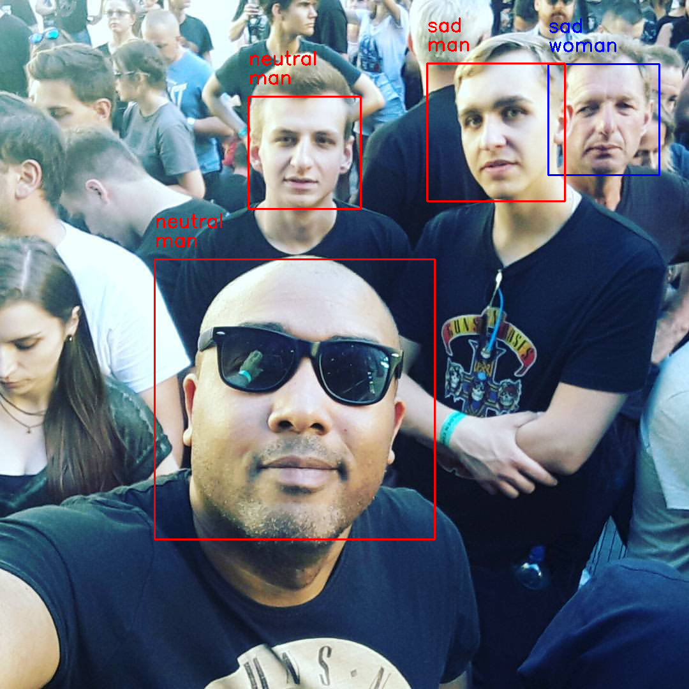
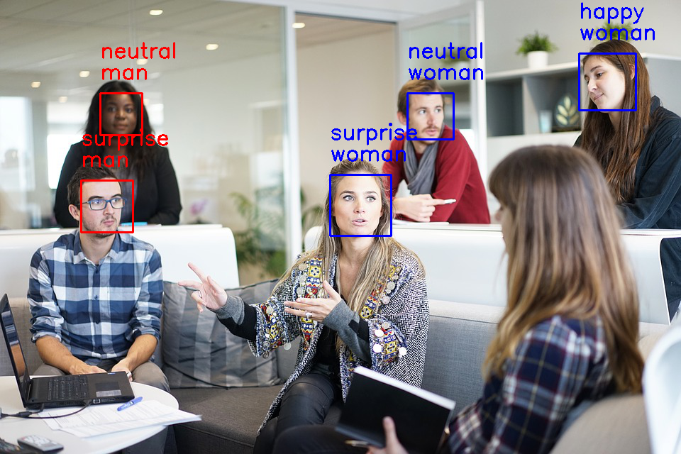

# Face classification and detection.
Real-time face detection and emotion/gender classification using fer2013/IMDB datasets with a keras CNN model and openCV.
* IMDB gender classification test accuracy: 96%.
* fer2013 emotion classification test accuracy: 66%.

# Emotion/gender examples:







## Instructions

### Run real-time emotion demo:


<div class="myvideo">
   <video  style="display:block; width:100%; height:auto;" autoplay controls loop="loop">
       <source src="/images/emotions.mp4" type="video/mp4" />
       <source src="{{ site.baseurl }}/images/emotions.ogv" type="video/ogg" />
       <source src="/images/emotions.webm"  type="video/webm"  />
   </video>
</div>
 
> python3 video_emotion_color_demo.py

### Run real-time guided back-prop demo:
> python3 image_gradcam_demo.py

### Make inference on single images:
> python3 image_emotion_gender_demo.py <image_path>

e.g.

> python3 image_emotion_gender_demo.py ../images/test_image.jpg

### Running with Docker

With a few steps one can get its own face classification and detection running. Follow the commands below:

* ```docker pull ekholabs/face-classifier```
* ```docker run -d -p 8084:8084 --name=face-classifier ekholabs/face-classifier```
* ```curl -v -F image=@[path_to_image]  http://localhost:8084/classifyImage > image.png```

### To train previous/new models for emotion classification:


* Download the fer2013.tar.gz file from [here](https://www.kaggle.com/c/challenges-in-representation-learning-facial-expression-recognition-challenge/data)

* Move the downloaded file to the datasets directory inside this repository.

* Untar the file:
> tar -xzf fer2013.tar

* Run the train_emotion_classification.py file
> python3 train_emotion_classifier.py

### To train previous/new models for gender classification:

* Download the imdb_crop.tar file from [here](https://data.vision.ee.ethz.ch/cvl/rrothe/imdb-wiki/) (It's the 7GB button with the tittle Download faces only).

* Move the downloaded file to the datasets directory inside this repository.

* Untar the file:
> tar -xfv imdb_crop.tar 

* Run the train_gender_classification.py file
> python3 train_gender_classifier.py

## References

Original project by the [B-IT-BOTS robotics team](https://mas-group.inf.h-brs.de/?page_id=622)

For more information please consult the [publication](https://github.com/oarriaga/face_classification/blob/master/report.pdf)
